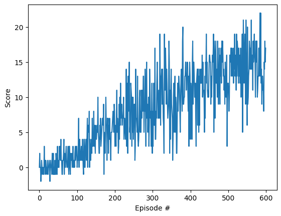
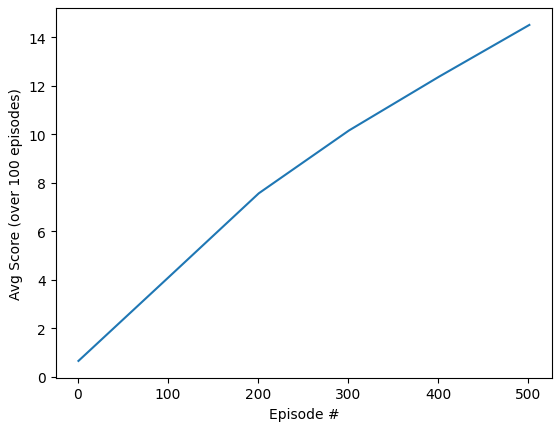
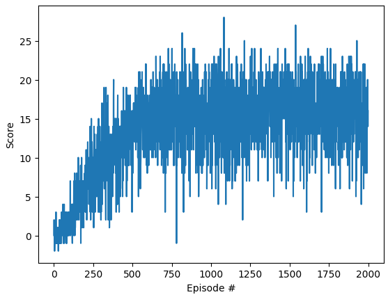
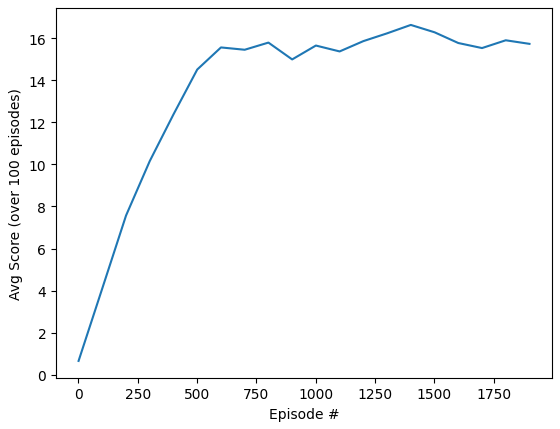

# What is this document?

This document details the code used to train the agent along with the results got with the training method and the agent used. At the end a section shows what are potential future works to improve the agent.

# The Agent
The Agent is based on the Deep Q-Learning agent code provided in the course. It is defined in the [dqn_agent.py](dqn_agent.py) file.

The agent uses a similar approach to the Deep Q-Networks used by DeepMind to learn Atari game ([Playing Atari with Deep Reinforcement Learning](https://arxiv.org/abs/1312.5602)) but with a MLP instead of a CNN as the game state is much simpler to learn (no need to process the raw pixels). Specifically the agent uses two improvements introduced by the Deep Q-Network paper:
- Fixed Q-Targets to help the neural networks to converge as the Q-table evolves during the training. Note that in this case the code uses a slightly different approach than the Fixed Q-Targets but with the same results (stabilizing the training by keeping target more stable), this approach is called Soft Update and is defined in [CONTINUOUS CONTROL WITH DEEP REINFORCEMENT LEARNING](https://arxiv.org/pdf/1509.02971) (see page 4). In practice the code uses two Q-networks (qnetwork_local and qnetwork_target). Only the Q-Local network is trained using an Adam optimizer and a classic backprogration method. The Q-Target weights are updated from the Q-Local network weights but with a interpolation between the new weights (from Q-Local) and the old weight (Q-Target) so that so values are following slowly the new values (if the interpolation parameters called Tau is small enough, here 1e-3)
- Experience Replay to randomize the experience use for learning in order to prevent the network to learn the relation between previous choice and subsequent choice.

## The model
Specifically it uses a Machine Learning Model defined in [dqn_model.py](dqn_model.py). This model is a Multi Layer Perceptron (MLP) created with PyTorch and using 3 layers:
- One input layer with the size of the state as entry (here 37) and an arbitrary size as output (here 64)
- One hidden layer with the an input size the same as the output from the previous layer and an arbitrary output size (here 64) 
- One final layer with the an input size the same as the output from the previous layer and an output size equals to the number of action. 

The model uses two ReLU (Rectified Linear Unit) as activation function between the layers. There is no specific activation function for the last layer (no tanh nor sofmax). The input layer and output layer are constrained by the environment info (State size for input, action size for output), the internal layer is the only one that can vary, we have kept the default value of 64 nodes as if provided good results.

This is indeed a very simple yet effective model (as show in the results below) able to learn how to play the game quite efficiently and rapidely.

## The Learning Algorithm
The learning algorithm is defined in the [dqn_agent.py](dqn_agent.py) through the following methods:

- step: allow the network to "memorize" (add in experience replay buffer) the current step and if enought samples are available in memory and that we have played enougth step (this is the UPDATE_EVERY hyperparameter set to every 4 steps in this code) learn from these past experience at random.
- act: get the next action based on the epsilon-greedy approach. The method first run the MLP for the qnetwork_local model to get all probabilities predicted by the network for this state then choose an action randomly but favoring the most probable one most of the time.
- learn: this method is called by the step method every "UPDATE_EVERY" time and is used to train the Q-Networks from the past experiences. It uses the Q_target network model to predict the next values for all the states, then compute the the current Q values for the current states and compare it to the predicted values from the Q_Local network (the one trained), then it computes the loss and do the backpropagation to update the Q-Local network. Then the target network (Q-Target) is updated using the Soft Update method already mentioned (similar to Fixed Q-targets).

Note that the step method uses "memories" stored in a ReplayBuffer that is also defined in this file. The ReplayBuffer is a structure used to store the S,A,R,S' values for each experience and to randomly sample those experiences when needed for learning.

# The results

As shown in the plots below, the algorithm was able to learn how to play the Bananas games in less than 600 episodes with a score of over 13 for each of the 100 last attempts. 

For the sake of readibility, the avg of the score over the last 100 attempts is also provided

Also as an experiment I have tried to let the model continue learning for 2000 episodes and we can see a limit in the number of points that the model can get (around 16 points maximum)

  

*Note*: see below for some ideas to improve this score.

Also here is a video of the game as played by the agent after being trained for 2000 episodes 

<video width="1290" height="762" controls>
  <source src="P1_bananas.mp4" type="video/mp4">
</video>

# Ideas for future work

This section lists some of the ideas to improve the algorithm:
- As suggested in the course, a natural next steps would be to implement a Leaning from Pixels model where the input is the screen rendering. 
- As visible in the video, the models tends to sometimes have "weird" movements, that is movement that seems non-human, looking left of right of a frame or two and going back to forward movement. One way to prevent this would be to "punish" the model for each movement that are followed by the opposite movement but this would require to change the bananas game code that we do not have access to.
- Another issue visible at the end of the video is a "flickering" where the agent doesn't know where to go, this is likely due to the raycasting algorithm used in the original bananas game that probably only sees the blue bananas in front (whereas some yellow bananas are visible behind). While fixing the bananas raycasting algo could be a solution, switching to the "Pixel based" learning should also solved that issue as the model will be more likely to "see" these bananas.
- As mentioned in the results section the model seems stuck to a maximum score of 16, however this might be due to the number of steps maximum for each episodes (fixed at 1000), by increasing this number it is likely that the game can play longer and see more bananas, but this hasn't been tested.